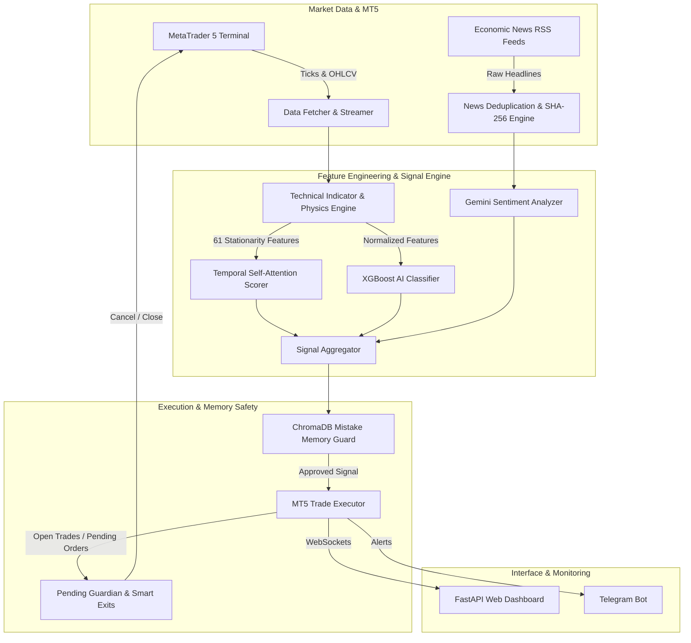

# 🏆 XAUUSD AI Trading Bot v3.0 Pro

[](https://www.python.org/downloads/)
[](https://www.metatrader5.com/)
[](https://fastapi.tiangolo.com/)
[](https://xgboost.readthedocs.io/)
[](https://ai.google.dev/)
[](LICENSE)

An institutional-grade, fully autonomous AI trading bot designed for **XAUUSD (Gold)** on **MetaTrader 5**. Features a **Temporal Self-Attention Market Scorer**, **XGBoost Machine Learning Engine**, **LLM Self-Learning & Failure Memory**, **Multi-Layer News Deduplication**, **Pending Order Guardian**, and a **Real-Time Web Dashboard** with live TradingView position overlays.

---

## 🌟 Key Features & Innovations

### 🧠 1. Temporal Self-Attention Market Scorer
Inspired by official MQL5 Algorithmic Trading Neural Network research:
- **Scaled Dot-Product Self-Attention**: Quantifies inter-period query/key relationships across multi-scale rolling feature windows (M1, M5, M15, H1).
- **Attention Concentration Index (ACI)**: Measures weight dispersion to detect regime switches, market compression, and breakout conviction.
- **Dynamic Threshold Adaptation**: Automatically tightens or loosens trade entry confidence requirements based on real-time market entropy.

### 📊 2. Candlestick Physics & Stationarity Engine
Processes 61 normalized features computed on every tick/candle:
- **Anatomy Ratios**: `candle_body_ratio`, `upper_wick_ratio`, `lower_wick_ratio`, and `candle_conviction`.
- **Stationarity Transformation**: Z-score normalized log-returns (`log_return_zscore_20`) preventing non-stationary drift.
- **Volume & Force Metrics**: `volume_intensity` and `effort_result_ratio` to validate institutional liquidity surges.

### 🤖 3. XGBoost Machine Learning Model
- **Large-Scale Training**: Trained on 10,000+ historical M5/M15 MT5 candles.
- **Probabilistic Scoring**: Generates calibrated confidence probabilities for `BUY`, `SELL`, and `NEUTRAL` signals.
- **Auto-Retraining Pipeline**: Standalone script (`scripts/train_ai.py`) for automated hyperparameter tuning and model export.

### 🧠 4. Autonomous Self-Learning & Mistake Memory Guard
- **Trade Post-Mortem Analysis**: Powered by Google Gemini LLM to analyze every losing trade.
- **Vector Database Memory**: Stores failure context in local `ChromaDB`.
- **Pre-Trade Guard Check**: Queries past mistake memory before issuing new trades to prevent repeating historic bad entries in similar market states.

### 🛡️ 5. Pending Order Guardian & Smart Midway Exits
- **Limit/Stop Order Guardian**: Continuously evaluates pending orders against shifted technical indicators or high-impact news, autonomously canceling obsolete limit orders.
- **Smart Midway Exits**: Monitors active position health, trailing stop loss based on ATR volatility, and exiting early if market sentiment flips sharply against open positions.

### 📰 6. Multi-Layer News & Sentiment Deduplication
- **SHA-256 Canonical Hashing**: Prevents redundant processing of duplicate RSS headlines across sources.
- **Temporal & Normalized Matching**: Strips timestamps, dynamic numbers, and source tags to eliminate repetitive news notifications and sentiment bias.
- **Impact Classification**: Integrates high-impact economic calendar events directly into signal filtering.

### 📈 7. Interactive Real-Time Web Dashboard
- **Live TradingView Position Overlay**: View real-time XAUUSD price action with interactive lines showing open `BUY`/`SELL` entries, Stop Loss, and Take Profit levels.
- **Streaming Metrics**: WebSocket-powered live P&L, balance, equity, win rate, drawdown, and risk meter.
- **Interactive Control Modal**: Quick regime inspection, model barometer score breakdown, and system status toggles.

### 📱 8. Telegram Remote Bot Controller
- **Interactive Keyboards**: Quick menu buttons for status, balance, manual trade triggers, and regime breakdown.
- **Commands**: `/regime`, `/status`, `/balance`, `/closeall`, `/cancelall`, `/help`.
- **Real-Time Push Notifications**: instant trade placement, pending order execution, stop loss hits, and news summary alerts.

---

## 🏗️ System Architecture



---

## 📂 Project Structure

```
XAUUSD-AI-Trading-Bot/
├── ai/                        # Machine Learning & Attention Scorer
│   ├── attention_scorer.py    # Temporal Self-Attention & Concentration Index
│   ├── classifier.py          # XGBoost Model Loading & Inference
│   ├── self_learning.py       # Gemini LLM Trade Post-Mortem & Vector DB Memory
│   └── models/                # Saved XGBoost (.json/.pkl) & Scalers
├── analysis/                  # Technical Indicators & Market Physics
│   ├── technical.py           # 61 Stationarity Features & Candlestick Anatomy
│   └── regime_detector.py     # Volatility, Trend & Entropy Regime Detection
├── config/                    # Configuration Files
│   ├── settings.py            # Central System Configuration & Parameters
│   └── .env                   # Environment Variables & API Keys
├── core/                      # Core Trading Engine
│   ├── bot.py                 # Main Trading Bot Orchestrator
│   ├── executor.py            # MT5 Trade Placement, SL/TP & Orders
│   ├── models.py              # Data Models (Signal, Trade, Regime)
│   └── mt5_interface.py       # MetaTrader 5 API Wrapper
├── dashboard/                 # Real-Time Web Interface
│   ├── app.py                 # FastAPI Web Server & API Routes
│   ├── templates/             # HTML Dashboard UI
│   └── static/                # CSS, JavaScript (Chart.js & TradingView)
├── database/                  # SQLite Database Storage
│   └── crud.py                # Trade History, System Logs & Metrics Persistence
├── news/                      # News & Sentiment Engine
│   ├── fetcher.py             # RSS Economic News Scraper
│   ├── news_utils.py          # SHA-256 Headline Normalization & Deduplication
│   └── analyzer.py            # Gemini Sentiment Analysis
├── notifications/             # Remote Telegram Interface
│   ├── telegram_bot.py        # Telegram Bot Commands & Async Handlers
│   └── keyboards.py           # Interactive Inline Keyboard Menus
├── scripts/                   # Training & Utility Scripts
│   └── train_ai.py            # XGBoost Model Training Script (10,000 candles)
├── audit_full_system.py       # System Diagnostic & End-to-End Verification
├── main.py                    # Application Entry Point
├── README.md                  # Project Documentation
└── requirements.txt           # Python Dependencies
```

---

## ⚡ Installation & Setup Guide

### 1. Prerequisites
- **Operating System**: Windows 10 / 11 (Required for MetaTrader 5 Python API).
- **Python**: Python 3.10 or higher.
- **MetaTrader 5**: Installed with an active Demo or Live trading account (Exness, IC Markets, etc.). Ensure **"Allow Algo Trading"** is enabled in MT5 `Tools -> Options -> Expert Advisors`.

### 2. Clone Repository & Install Dependencies
```bash
git clone https://github.com/YourUsername/XAUUSD-AI-Trading-Bot.git
cd XAUUSD-AI-Trading-Bot

# Create virtual environment
python -m venv venv
venv\Scripts\activate

# Install dependencies
pip install -r requirements.txt
```

### 3. Configure Environment Variables
Create or update the `.env` file in the `config/` directory:
```env
# MetaTrader 5 Credentials
MT5_ACCOUNT=12345678
MT5_PASSWORD=YourPasswordHere
MT5_SERVER=Exness-MT5Trial6

# Telegram Bot Integration
TELEGRAM_BOT_TOKEN=123456789:ABCdefGhIJKlmNoPQRsTUVwxyZ
TELEGRAM_CHAT_ID=987654321

# Google Gemini API Key (For Sentiment & Self-Learning Memory)
GEMINI_API_KEY=AIzaSyYourGeminiApiKeyHere

# Bot Operational Settings
SYMBOL=XAUUSD
TIMEFRAME=M5
RISK_PERCENT=1.0
MAX_POSITIONS=3
```

---

## 🚀 Running the Bot

### Start Full Suite (Trading Bot + Web Dashboard + Telegram Bot)
```bash
python main.py --dashboard
```
- **Web Dashboard**: Access at [`http://127.0.0.1:8080`](http://127.0.0.1:8080)
- **Telegram Bot**: Active and responding to chat commands.

### Start Trading Bot Only (Headless)
```bash
python main.py
```

### Retrain XGBoost AI Model
To fetch fresh M5/M15 historical data from MT5 and train the XGBoost classifier on 10,000 candles:
```bash
python scripts/train_ai.py
```

### Run Diagnostic System Audit
To test MT5 connectivity, Gemini LLM API, News Deduplication, Web Dashboard, and Self-Attention Engine:
```bash
python audit_full_system.py
```

---

## 📱 Telegram Commands & Controls

| Command | Description |
| :--- | :--- |
| `/start` | Launch interactive menu and main dashboard overview |
| `/status` | Check live bot operational health, open trades, and MT5 connection |
| `/regime` | View real-time Market Regime, Volatility, and Self-Attention score |
| `/balance` | View Account Equity, Free Margin, and Floating P&L |
| `/closeall` | Immediately emergency close all open positions |
| `/cancelall` | Cancel all active pending limit/stop orders |
| `/help` | View help and command reference |

---

## 🛡️ Risk & Safety Disclaimer

> [!WARNING]
> Trading Forex and Gold (XAUUSD) involves substantial risk of loss and is not suitable for all investors. Past performance of algorithmic or machine learning models is not indicative of future results. Always test thoroughly on a **Demo Account** before deploying live capital.

---

## 📜 License
This project is licensed under the [MIT License](LICENSE).
